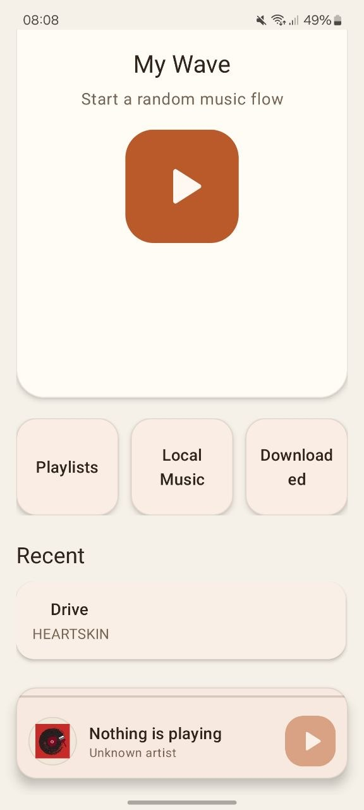
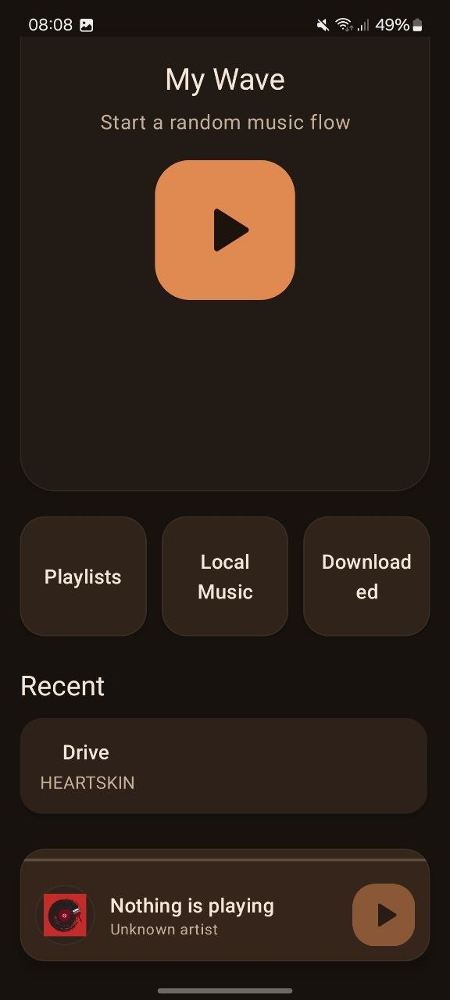
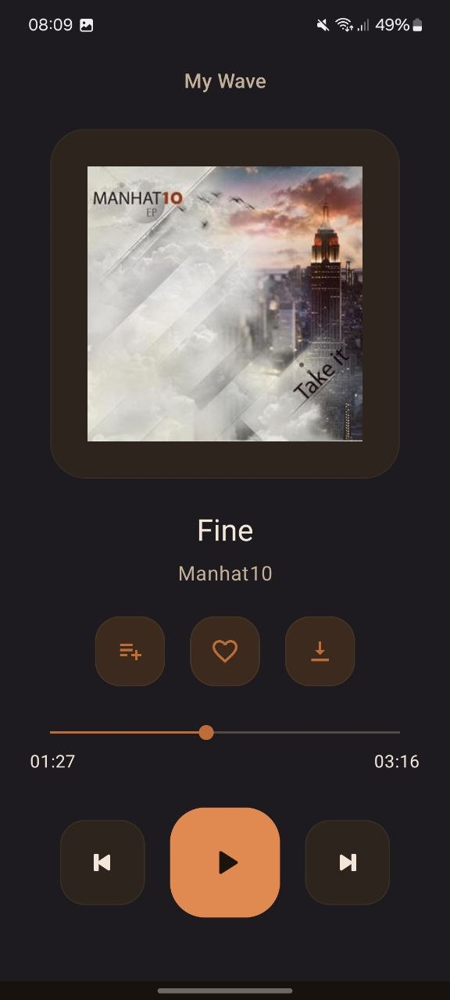
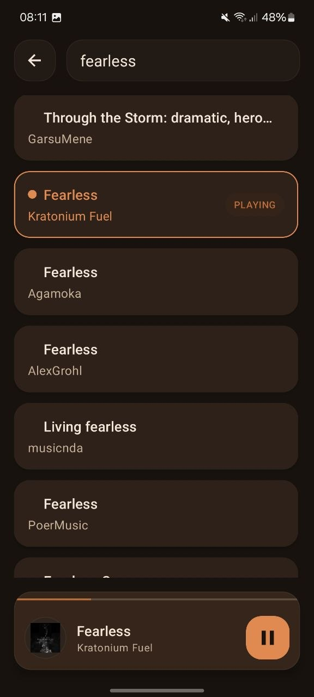
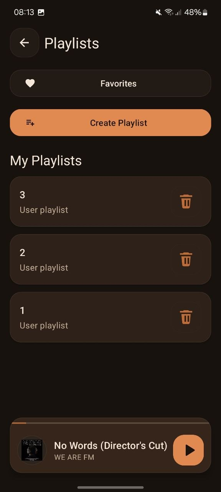
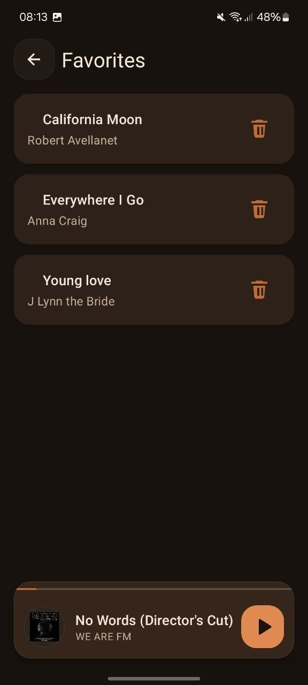
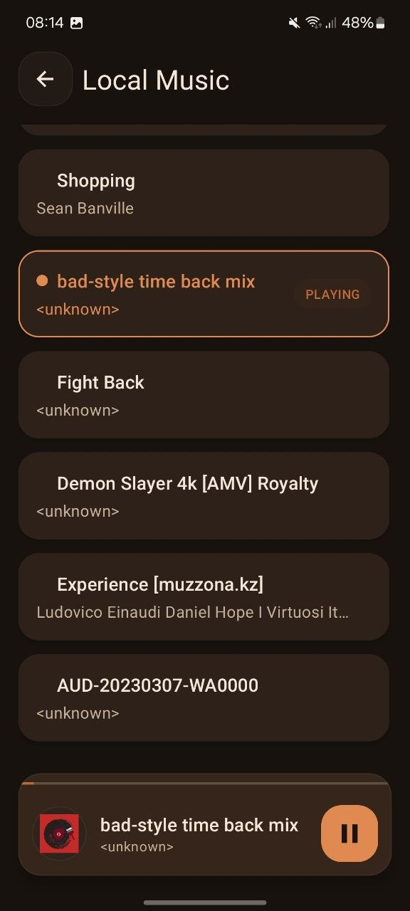
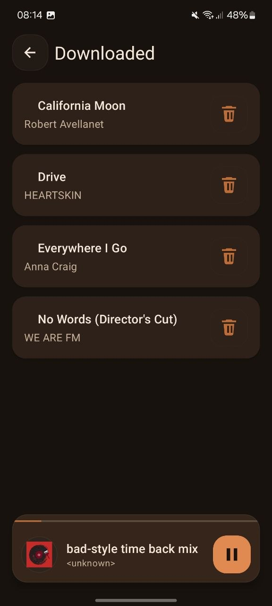

# MyMusicPlayer

`MyMusicPlayer` is an Android music player built with `Java`, `XML`, `MVVM`, `Room`, `Retrofit`, and `Media3 ExoPlayer`.

It combines online discovery, local playback, downloaded tracks, playlists, favorites, a shared player flow across screens, and light/dark themes in a simple junior-friendly architecture.

---

## English

### Overview
MyMusicPlayer is a complete Android music player project focused on practical architecture, readable Java code, and a polished user experience without unnecessary complexity.

The app uses a simple `MVVM + Repository` structure and keeps business logic out of activities. It supports online music browsing, local audio playback, downloaded tracks, playlists, favorites, background playback, notification controls, and playback state continuity between screens.

### Screenshots

| Home Light                                     | Home Dark                                    |
|------------------------------------------------|----------------------------------------------|
|  |  |

| Player | Search |
| --- | --- |
|  |  |

| Playlists | Playlist Details |
| --- | --- |
|  |  |

| Local Music | Downloaded |
| --- | --- |
|  |  |

### Features
- `My Wave` online track flow powered by Jamendo
- Direct online search by title or artist
- Local music loading from `MediaStore`
- Downloaded tracks playback from local storage
- Favorites support
- Custom playlists with track add/remove flow
- Shared mini-player and bottom-sheet full player
- Background playback service
- Notification controls: previous, play/pause, next
- Audio focus handling
- `ACTION_AUDIO_BECOMING_NOISY` handling
- Last played track and position restore
- Separate playback contexts for `My Wave`, `Recent`, `Search`, `Local Music`, `Downloaded`, `Favorites`, and playlist playback
- Offline / online mode handling
- Manual refresh on content screens
- Light / dark theme toggle
- Playing-track highlighting in lists
- Download progress notifications

### Tech Stack
- `Java`
- Android Views + `XML`
- `MVVM + Repository`
- `Room`
- `Retrofit`
- `OkHttp`
- `Media3 ExoPlayer`
- `RecyclerView`
- `ViewBinding`
- `Material Design`

### Project Structure
- `app/src/main/java/com/example/mymusicplayer/data`  
  Data layer: Room, Retrofit, repository, entities, DAOs
- `app/src/main/java/com/example/mymusicplayer/playback`  
  Background playback service and playback state handling
- `app/src/main/java/com/example/mymusicplayer/ui`  
  Activities, adapters, view models, bottom-sheet player
- `app/src/main/java/com/example/mymusicplayer/util`  
  Theme, network, downloads, playback helpers
- `app/src/main/res`  
  Layouts, themes, icons, colors, and strings

### Build Requirements
- Android Studio
- Android SDK configured in `local.properties`
- JDK available through Android Studio JBR
- Jamendo API client id in `local.properties`

```properties
jamendoClientId=YOUR_CLIENT_ID
```

### Build Notes
On this machine, the Windows system temp directory is unreliable for Room verification, so Gradle should use the project-local `.tmp` directory.

Working build command:

```powershell
$env:JAVA_HOME='C:\Program Files\Android\Android Studio\jbr'
$env:PATH="$env:JAVA_HOME\bin;$env:PATH"
$env:JAVA_TOOL_OPTIONS='-Djava.io.tmpdir="C:\Users\Usmon Aliev\AndroidStudioProjects\MyMusicPlayer\.tmp"'
.\gradlew assembleDebug
```

### Current Status
- the core feature set is completed
- the application is already a full working product
- the current focus is final review, presentation, and manual QA

### What Is Intentionally Not Included
- No Clean Architecture layer split
- No Use Cases layer
- No `MediaBrowserService`
- No equalizer
- No advanced navigation framework

The project intentionally stays simple and readable for a junior-friendly codebase.

---

## Русский

### О проекте
MyMusicPlayer — это полноценный Android-плеер, собранный с упором на понятную архитектуру, читаемый Java-код и аккуратный пользовательский интерфейс без лишнего усложнения.

Проект использует простую структуру `MVVM + Repository` и не переносит бизнес-логику в `Activity`. Приложение поддерживает онлайн-поиск музыки, локальное воспроизведение, скачанные треки, плейлисты, избранное, фоновое воспроизведение, управление из уведомлений и сохранение состояния плеера между экранами.

### Скриншоты

Скриншоты выше показывают главный экран в светлой и тёмной теме, полноэкранный плеер, поиск, плейлисты, детали плейлиста, локальную музыку и скачанные треки.

### Возможности
- Онлайн-поток `My Wave` через Jamendo
- Онлайн-поиск по названию и артисту
- Загрузка локальной музыки из `MediaStore`
- Воспроизведение скачанных треков из локального хранилища
- Избранное
- Пользовательские плейлисты с добавлением и удалением треков
- Общий mini-player и bottom-sheet full player
- Фоновый playback service
- Управление из уведомлений: previous, play/pause, next
- Обработка audio focus
- Обработка `ACTION_AUDIO_BECOMING_NOISY`
- Восстановление последнего трека и позиции
- Отдельные playback-контексты для `My Wave`, `Recent`, `Search`, `Local Music`, `Downloaded`, `Favorites` и воспроизведения плейлистов
- Обработка online / offline режима
- Ручное обновление экранов через swipe refresh
- Переключение светлой и тёмной темы
- Подсветка активного трека в списках
- Уведомления о прогрессе скачивания

### Технологии
- `Java`
- Android Views + `XML`
- `MVVM + Repository`
- `Room`
- `Retrofit`
- `OkHttp`
- `Media3 ExoPlayer`
- `RecyclerView`
- `ViewBinding`
- `Material Design`

### Структура проекта
- `app/src/main/java/com/example/mymusicplayer/data`  
  Слой данных: Room, Retrofit, repository, сущности и DAO
- `app/src/main/java/com/example/mymusicplayer/playback`  
  Фоновый сервис воспроизведения и логика playback state
- `app/src/main/java/com/example/mymusicplayer/ui`  
  Экраны, адаптеры, view model и bottom-sheet player
- `app/src/main/java/com/example/mymusicplayer/util`  
  Тема, сеть, загрузки и playback helper-классы
- `app/src/main/res`  
  Layout-файлы, темы, иконки, цвета и строки

### Что нужно для сборки
- Android Studio
- Android SDK, прописанный в `local.properties`
- JDK через Android Studio JBR
- Jamendo API client id в `local.properties`

```properties
jamendoClientId=YOUR_CLIENT_ID
```

### Важная заметка по сборке
На этой машине системная временная директория Windows нестабильна для Room verification, поэтому Gradle лучше запускать через локальную `.tmp` папку проекта.

Рабочая команда:

```powershell
$env:JAVA_HOME='C:\Program Files\Android\Android Studio\jbr'
$env:PATH="$env:JAVA_HOME\bin;$env:PATH"
$env:JAVA_TOOL_OPTIONS='-Djava.io.tmpdir="C:\Users\Usmon Aliev\AndroidStudioProjects\MyMusicPlayer\.tmp"'
.\gradlew assembleDebug
```

### Текущее состояние
- основной функционал завершён
- приложение по сути уже является готовым рабочим продуктом
- текущий фокус — финальный review, оформление и ручной QA

### Что намеренно не добавлялось
- Нет Clean Architecture
- Нет слоя Use Cases
- Нет `MediaBrowserService`
- Нет эквалайзера
- Нет тяжёлой навигационной системы

Проект специально держится простым и читаемым, чтобы кодовая база оставалась понятной и удобной для дальнейшей доработки.
